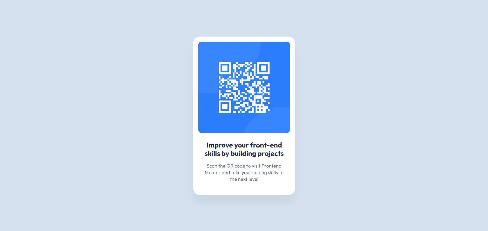

# Frontend Mentor - QR code component solution

This is a solution to the [QR code component challenge on Frontend Mentor](https://www.frontendmentor.io/challenges/qr-code-component-iux_sIO_H). Frontend Mentor challenges help you improve your coding skills by building realistic projects.

## Table of contents

- [Overview](#overview)
  - [Screenshot](#screenshot)
  - [Links](#links)
- [My process](#my-process)
  - [Built with](#built-with)
  - [What I learned](#what-i-learned)
  - [Continued development](#continued-development)
  - [Useful resources](#useful-resources)
- [Author](#author)
- [Acknowledgments](#acknowledgments)

## Overview

### Screenshot



### Links

- Solution URL: [GitHub](https://github.com/runny-life/qr-code-component)
- Live Site URL: [GH Pages](https://runny-life.github.io/qr-code-component/)

## My process

### Built with

- Semantic HTML5 markup (`<main>`, `<article>`, `<h1>`, `<h2>`, `<p>`)
- CSS custom properties (variables for colors, fonts, and spacing)
- Flexbox (for centering the card and arranging content)
- Mobile-first responsive design
- Accessibility features (`.visually-hidden` class, `aria-labelledby`, `aria-describedby`)
- [Outfit](https://fonts.google.com/specimen/Outfit) font from Google Fonts

### What I learned

This project was a great opportunity to reinforce my understanding of building a clean, accessible, and pixel-perfect UI component. Here are the key takeaways:

1. **CSS Custom Properties** – Using `:root` variables made the code more maintainable and consistent:

```css
:root {
  --white: #ffffff;
  --salte-300: #d5e1ef;
  --salte-500: #68778d;
  --salte-900: #1f314f;
  --ff-base: "Outfit", sans-serif;
}
```

2. **Accessibility** – I used a `.visually-hidden` class to hide the main heading visually while keeping it available for screen readers, and added `aria-labelledby` and `aria-describedby` to associate the card's title and description with the `<article>` element:

```html
<h1 class="visually-hidden">Qr code component</h1>

<article
  class="card"
  aria-labelledby="card-title"
  aria-describedby="card-description"
>
  <h2 class="card__title" id="card-title">...</h2>
  <p class="card__description" id="card-description">...</p>
</article>
```

3. **BEM Naming Convention** – I used the BEM methodology (`card`, `card__wrapper-image`, `card__body, card__title`, `card__description`) to keep the CSS organized and scalable.

4. **Responsive Images** – The QR code image is set to `width: 100%; height: auto;` to ensure it scales properly within its container, and `object-fit: cover` maintains the aspect ratio within the rounded wrapper.

5. **Flexbox Centering** – Using `display: flex` with `align-items: center` and `justify-content: center` on the `<main>` element made it easy to vertically and horizontally center the card:

```css
main {
  display: flex;
  align-items: center;
  justify-content: center;
  min-height: 100vh;
  padding-inline: 2.75rem;
}
```

6. **Box Shadow** – The subtle shadow (box-shadow: 0 25px 25px 0 rgba(0, 0, 0, 0.05)) gives the card a nice floating effect without being too heavy.

### Continued development

In future projects, I want to continue focusing on:

- **Accessibility first** – Making sure all components are fully accessible with proper ARIA attributes, semantic HTML, and keyboard navigation support.
- **Performance optimization** – Exploring techniques like lazy loading images and optimizing font loading.
- **CSS architecture** – Deepening my understanding of methodologies like BEM and exploring CSS Modules or utility-first frameworks like Tailwind CSS.
- **Responsive typography** – Using clamp() and calc() for fluid typography that scales seamlessly across viewport sizes.

### Useful resources

- [MDN Web Docs: ARIA](https://developer.mozilla.org/en-US/docs/Web/Accessibility/ARIA) - Helped me understand how to properly use aria-labelledby and aria-describedby.
- [CSS-Tricks: A Complete Guide to Flexbox](https://css-tricks.com/snippets/css/a-guide-to-flexbox/) - A great reference for flexbox properties.
- [BEM 101](https://css-tricks.com/bem-101/) - Helped me structure my CSS classes in a scalable way.

## Author

- Website - [GitHub](https://github.com/runny-life)
- Frontend Mentor - [@runny-life](https://www.frontendmentor.io/profile/runny-life)

## Acknowledgments

Thanks to Frontend Mentor for providing this challenge and the design files. It's a great platform for practicing real-world front-end skills. Also, thank you to the open-source community for the excellent documentation and resources that make learning accessible to everyone.
